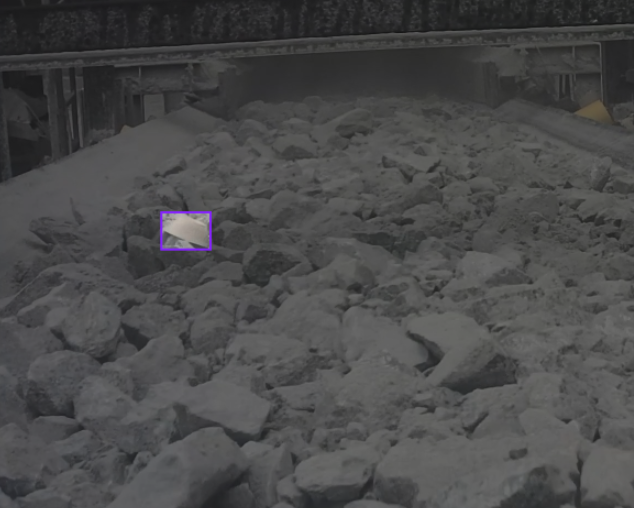
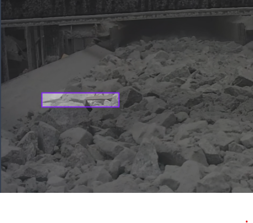

# Real-Time Foreign Object Detection System

This project implements a real-time foreign object detection system for industrial conveyor belt applications using a YOLOv8 PyTorch model. The system continuously monitors a conveyor belt, detecting non-ore foreign objects (such as metal pieces or debris) and immediately halts the conveyor to prevent damage. This solution is designed for environments where fast, accurate detection of foreign objects is crucial to avoid costly downtime and machinery damage.

## Table of Contents
- Project Overview
- Features
- Architecture
- Getting Started
- Installation
- Configuration
- Usage
- Real-Time Conveyor Control
- Customization
- Labeling and Evaluation
- Results and Performance
- Future Enhancements
- Contributing
- License
- Contact

## Project Overview
The purpose of this project is to develop a robust, real-time foreign object detection pipeline for conveyor belt applications in industrial settings. Using a trained YOLOv8 model, the system can recognize and flag foreign objects in real-time, triggering an alert or halting the conveyor to prevent potential hazards or damage. This solution is ideal for industries such as mining, manufacturing, and recycling, where conveyor belt monitoring is essential.

## Features
- **Real-Time Monitoring**: Uses a high-frame-rate camera feed for continuous monitoring.
- **Efficient Detection**: Detects foreign objects on the conveyor belt with YOLOv8's high-speed inference capabilities.
- **Automated Response**: Pauses the conveyor automatically upon detecting a foreign object.
- **User Interface**: Displays the current frame with detection results for real-time monitoring by operators.
- **Configurable Confidence Threshold**: Allows customization of the detection sensitivity to minimize false positives.

## Architecture
The pipeline follows these main steps:
1. **Image Capture**: Acquires real-time images from the conveyor camera.
2. **Data Ingestion**: Streams the captured images into the processing pipeline.
3. **Preprocessing Module**: Resizes and normalizes images for model compatibility.
4. **Model Inference**: Runs YOLOv8 on the preprocessed images for object detection.
5. **Alert Mechanism**: Triggers an alert and halts the conveyor upon detection of foreign objects above the confidence threshold.
6. **User Interface**: Displays detection results and the conveyor's operational status.
7. **Data Logging**: Stores detected frames and events for future analysis and model retraining.

## Getting Started

### Prerequisites
- Python 3.8+
- PyTorch and OpenCV (for model inference and camera handling)
- YOLOv8 Model trained on your specific dataset
- High-frame-rate camera (e.g., 60FPS) for continuous monitoring

### Folder Structure
Here's an example of the recommended folder structure for this project:

```
foreign-object-detection/
├── model/                    # YOLOv8 model file
│   └── yolo_model.pt         # Trained YOLOv8 model
├── scripts/                  # Python scripts
│   └── main.py               # Main execution script
├── data/                     # Folder for storing original and processed data
│   ├── labeled_samples/      # Sample images with manual labeling
│   ├── predictions/          # Images with model predictions
│   └── evaluation/           # Confusion matrix and other evaluation results
├── results/                  # Folder for storing detection results and logs
├── images/                   # Folder for storing images used in the README
│   ├── sample_label.png      # Example of a labeled image from CVAT
│   ├── model_prediction.png  # Example of model prediction on test data
│   └── confusion_matrix.png  # Confusion matrix for evaluation
├── config.yaml               # Configuration file for setting parameters
└── README.md                 # Project documentation
```

## Installation
Clone the repository:

```bash
git clone https://github.com/your-username/foreign-object-detection.git
cd foreign-object-detection
```

Install dependencies: Ensure you have Python installed. Then install the required packages:

```bash
pip install -r requirements.txt
```

Download the YOLOv8 model: Place your trained YOLOv8 model (in .pt format) in the model directory.

## Configuration
Edit the config.yaml file to set parameters according to your setup:

```yaml
camera_index: 0               # Index of the camera (0 for default)
model_path: "model/yolo_model.pt"  # Path to the YOLOv8 model
confidence_threshold: 0.8     # Confidence threshold for foreign object detection
output_dir: "results"         # Directory to store logs and results
alert_timeout: 5              # Number of seconds to halt conveyor after detection
```

### Parameters:
- `camera_index`: The index of the camera in OpenCV (use 0 for default).
- `model_path`: Path to the trained YOLOv8 model file.
- `confidence_threshold`: Detection confidence threshold (between 0 and 1).
- `output_dir`: Directory to save detection frames and logs.
- `alert_timeout`: How long the conveyor remains paused after detecting a foreign object.

## Usage
Run the following command to start the real-time detection pipeline:

```bash
python scripts/main.py
```

### Sample Output
When the program is running, the camera feed will open in a new window. Detected objects will be highlighted, and if a foreign object is detected with confidence above the threshold, an alert message will appear, and the conveyor will pause.

Press `q` to exit the application.

## Real-Time Conveyor Control
This pipeline includes a simulated conveyor control system. The following functions handle conveyor operations:
- `halt_conveyor()`: Pauses the conveyor upon detection of a foreign object.
- `resume_conveyor()`: Resumes conveyor operation when no foreign objects are detected.

### Integration with Real Conveyor Systems
For real-world applications, replace the functions in `halt_conveyor()` and `resume_conveyor()` with API calls or commands that interact with the actual conveyor control system. Examples may include sending REST API requests or using IoT controllers to manage the conveyor.

## Customization
You can customize various aspects of the pipeline based on your needs:
- **Model**: Retrain or fine-tune the YOLOv8 model with additional data to improve detection accuracy.
- **Confidence Threshold**: Adjust `confidence_threshold` to control detection sensitivity.
- **Alert System**: Integrate with SMS or email notifications for remote alerts.

## Labeling and Evaluation

### 1. Initial Labeling with CVAT
- **Label a Sample of Data**: Begin by manually labeling a small, diverse subset of images in CVAT to establish accurate training data.
- **Export Labels**: Once labeled, export the annotations in a format compatible with YOLOv8.

### 2. Automated Labeling in RoboFlow
- **Upload Data and Model to RoboFlow**: Upload both the data and trained YOLOv8 model to RoboFlow for automated labeling.
- **Automated Labeling**: Use the model in RoboFlow to label additional data, minimizing the need for manual labeling.

### 3. Visualizing Sample Images
- **Labeled Images**: Sample labeled image from CVAT.
  
  
  
  

- **Model Prediction**: Example of model prediction on test data.
  

### 4. Model Evaluation
- **Confusion Matrix**: Confusion matrix generated for model evaluation.
  

### How to Add Images to README
To add your own images to this README, store images in the `images` folder as shown in the folder structure. Then, reference the images in Markdown syntax like this:

```markdown

```

## Results and Performance
- **Inference Speed**: The system is designed for real-time detection, achieving high speeds with minimal latency on compatible hardware.
- **Accuracy**: The YOLOv8 model should be trained on high-quality, diverse data to achieve optimal accuracy in detecting foreign objects.
Results will be saved in the `results/` directory, including frames with detected objects and log files.

## Future Enhancements
Possible improvements and future directions:
- **Multicamera Support**: Extend support for multiple cameras along the conveyor.
- **Enhanced Alert System**: Add notifications via SMS, email, or IoT alarms.
- **Remote Monitoring Dashboard**: Develop a web-based dashboard to monitor conveyor status in real-time.
- **Automated Retraining**: Implement a feedback loop to automatically retrain the model with new data.

## Contributing
We welcome contributions! If you'd like to contribute, please follow these steps:
1. Fork the repository.
2. Create a new branch (`git checkout -b feature-branch`).
3. Commit your changes (`git commit -m 'Add feature'`).
4. Push to the branch (`git push origin feature-branch`).
5. Create a new Pull Request.

## License
This project is licensed under the MIT License. See the LICENSE file for details.

## Contact
If you have any questions or feedback, feel free to reach out to the authors:
- **Raiyan Mokhammad**: MrFunnyMonkey2468@gmail.com
- **Chijindu Okafor**: chijindu12@gmail.com
- **Timur Rakhimov**: timur.rakhimov.02@gmail.com
